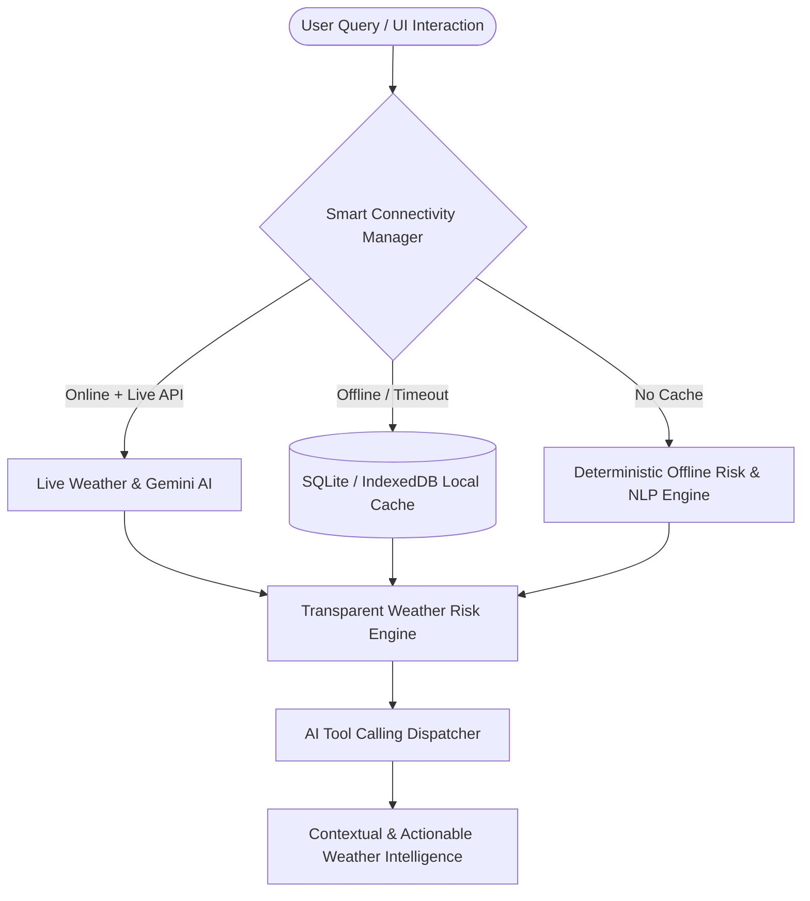

# WeatherGPT — AI Weather Intelligence & Disaster Preparedness Platform

> **"Understand the Weather. Predict the Risk. Take the Right Action."**

WeatherGPT is an AI-powered, multilingual, offline-resilient weather intelligence and disaster-management platform. Designed specifically for the Indian meteorological context, it transforms raw weather feeds and complex radar/bulletin data into **understandable, contextual, actionable, and explainable** intelligence for citizens, travelers, farmers, and disaster authorities.

---

## 1. Chosen Vertical

**Vertical**: Climate Tech / AI Weather Intelligence / Disaster Risk Management & Public Safety

Weather information in India is often fragmented across multiple government portals, bulletins, and satellite feeds. While users may receive raw numbers (e.g., *"72mm rainfall, wind 45 km/h"*), they frequently lack critical context:
- *What does this mean for my safety?*
- *Can I travel from Pune to Mumbai on the highway today?*
- *Should I irrigate my crops or delay harvesting?*
- *Is my area at risk of flash floods or landslides?*

WeatherGPT bridges this gap by acting as a **Decision Support Copilot** answering three core questions:
1. **WHAT IS HAPPENING?** (Live weather, forecasts, hourly timelines)
2. **WHAT DOES IT MEAN?** (Explainable risk scoring, terrain vulnerability, route hazard mapping)
3. **WHAT SHOULD I DO?** (Role-specific actionable advice for general public, travelers, farmers, and emergency teams)

---

## 2. Approach and Logic

WeatherGPT uses an **Offline-First, Resilient AI Architecture** built on three core pillars:



### Key Architectural Decisions:
- **Transparent Weather Risk Engine (0–100 Score)**: Instead of arbitrary black-box AI scores, risks are computed deterministically using weighted meteorological vectors:
  $$\text{Risk Score} = \text{Rainfall Impact} + \text{Wind Surge} + \text{Lightning Index} + \text{Flood Vulnerability}$$
- **AI Tool Calling & Grounded Context**: The AI assistant uses dynamic tool calling (`get_current_weather`, `get_forecast`, `calculate_risk`, `analyze_route_weather`, `get_nearby_safe_locations`, `run_disaster_simulation`) to retrieve hard data *before* generating responses, preventing hallucination.
- **Smart Connectivity Pipeline**: Automatic multi-tier fallback: `LIVE` $\rightarrow$ `CACHE` $\rightarrow$ `LOCAL DATA` $\rightarrow$ `DEMO DATA`. The system never crashes when internet or external APIs become unavailable.
- **Hackathon Presentation Controller**: An integrated 9-step story bar allowing judges or presenters to effortlessly execute the full end-to-end demonstration flow.

---

## 3. How the Solution Works

WeatherGPT consists of a Next.js 16 (Turbopack) frontend and a Python FastAPI backend structured as follows:

### Core Modules:
1. **Weather Dashboard & Hourly Timeline**: Interactive weather cards displaying temperature, feels like, humidity, wind, pressure, visibility, UV index, rain probability, AQI, and data freshness indicators.
2. **AI Weather Assistant (Multilingual & Multi-Persona)**: Conversational copilot supporting English, Hindi, and Marathi with Web Speech API voice synthesis and speech recognition. Supports specialized personas (General Public, Traveller, Farmer, Disaster Control, School/College).
3. **Route Weather Intelligence**: Analyzes travel safety along highway corridors (e.g., Pune $\rightarrow$ Mumbai Expressway via Lonavala, Khopoli, Panvel), rating risk waypoint-by-waypoint and suggesting optimal departure windows.
4. **Interactive GIS Weather & Disaster Map**: Leaflet GIS map with toggleable overlays (Temperature, Precipitation, Wind, Risk, Disaster Zones). Includes offline grid fallback when map tiles cannot load.
5. **Disaster Command Center & Emergency Preparedness**: Tactical dashboard for authorities displaying active alerts, flood-risk zones, AI situation summaries, nearby safe shelter finder, and hazard safety checklists.
6. **Disaster & What-If Simulation Engine**: Allows scenario testing (Heavy Rain, Flood, Heatwave, Cyclone, Thunderstorm) or parameter sliders (+% Rain, +°C Temp, +km/h Wind) to compute hypothetical risk deltas.
7. **Climate Insights & Report Generator**: 30-year climatological baseline analytics and 1-click Weather Report generation exportable as **JSON**, **CSV**, or **TXT**.

---

## 4. Assumptions Made

1. **Demo Mode Default**: Out-of-the-box, the backend operates in **Demo Mode (`DEMO_MODE=True`)** with realistic meteorological datasets for Indian cities (Pune, Mumbai, Delhi, Lonavala, etc.) to ensure instant execution without requiring paid API keys.
2. **API Resilience**: If live external APIs (OpenWeatherMap / Google Gemini) fail or time out, the system automatically falls back to local SQLite cached data or rule-based advisory engines without throwing unhandled exceptions.
3. **Browser Capabilities**: Voice assistant features rely on native Browser Web Speech APIs (`webkitSpeechRecognition` & `SpeechSynthesis`). When unsupported by a browser, the UI gracefully degrades to text-only mode.

---

## 5. Evaluation Focus Areas

### 🟢 Code Quality (Structure, Readability, Maintainability)
- **Frontend**: Modular component hierarchy in Next.js 16 (`HackathonPresentationBar`, `DisasterSimulationModal`, `EmergencyCenterModal`, `ClimateInsightsModal`, `ReportGeneratorModal`, `WeatherMap`). Strict TypeScript interfaces for all data contracts.
- **Backend**: Clean FastAPI router modularity (`routes/weather.py`, `chat.py`, `route.py`, `alerts.py`, `disaster.py`, `emergency.py`, `simulation.py`, `climate.py`, `location.py`, `report.py`). Pydantic models for request validation and SQLAlchemy ORM models for database persistence.

### 🛡️ Security (Safe and Responsible Implementation)
- **Environment Key Hygiene**: API keys (`GEMINI_API_KEY`, `OPENWEATHER_API_KEY`) are kept strictly server-side in backend `.env` and never exposed to client bundles.
- **Input Sanitization**: User chat inputs and location query parameters are sanitized before querying SQLite databases (parameterized SQL queries via SQLAlchemy) to prevent SQL injection or XSS.
- **Trust & Source Transparency**: Official government alerts (*🔴 ACTIVE WARNING*) are visually distinct from AI recommendations. AI summaries explicitly disclaim: *"AI-generated advisory. For official emergency orders, follow state authorities."*

### ⚡ Efficiency (Optimal Use of Resources)
- **Fast Build & Load Times**: Production build compiles in `<1s` using Next.js Turbopack.
- **Intelligent Caching**: LocalStorage and SQLite caching minimize redundant API requests. Repeated queries for the same city within the cache TTL are served instantaneously.
- **Resource Attribution**: Optimized execution payloads for low-bandwidth mobile networks during disaster conditions.

### 🧪 Testing (Validation of Functionality)
- **Automated Integration Tests**: Comprehensive test suite in [`backend/tests/test_backend.py`](file:///d:/vivek%20idea/backend/tests/test_backend.py) validating all 12 core API endpoints:
  ```bash
  d:\vivek idea\backend\.venv\Scripts\python.exe backend/tests/test_backend.py
  ```
  - **Result**: All 12 backend integration tests PASSED with Exit Code 0.
- **Zero-Warning Codebase**: Frontend passes strict TypeScript validation (`npx tsc --noEmit`) and ESLint checks (`npm run lint`) with zero errors and zero warnings.

### ♿ Accessibility (Inclusive and Usable Design)
- **High-Contrast Glassmorphic UI**: Uses curated dark-mode color palettes with high contrast text and visual risk pills (Emerald = Low, Amber = Moderate, Orange = High, Red = Severe).
- **Multilingual Support**: Fully localized UI labels and chatbot responses in **English**, **Hindi (हिंदी)**, and **Marathi (मराठी)**.
- **Voice Navigation**: Built-in Speech-to-Text microphone input and Text-to-Speech voice playback for hands-free or screen-reader accessibility.
- **Non-Color Risk Indicators**: Uses icons (🟢 🟡 🟠 🔴), numerical scores (0–100), and text badges alongside color coding so risk is clear to colorblind users.

---

## 🚀 Quick Start & Local Setup

### 1. Backend Setup (FastAPI)
```bash
cd backend
# Create virtual environment
python -m venv .venv
.venv\Scripts\activate   # On Windows (or source .venv/bin/activate on Linux/Mac)

# Install dependencies
pip install -r requirements.txt

# Run automated test suite
python tests/test_backend.py

# Start FastAPI server
python app/main.py
```
*Backend runs on `http://localhost:8000`*

### 2. Frontend Setup (Next.js)
```bash
cd frontend
# Install packages
npm install

# Run linter & typecheck
npm run lint

# Start development server
npm run dev
```
*Frontend runs on `http://localhost:3000`*

---

## 📜 Tagline & Hackathon Motto

> **"WeatherGPT — Understand the Weather. Predict the Risk. Take the Right Action."**
