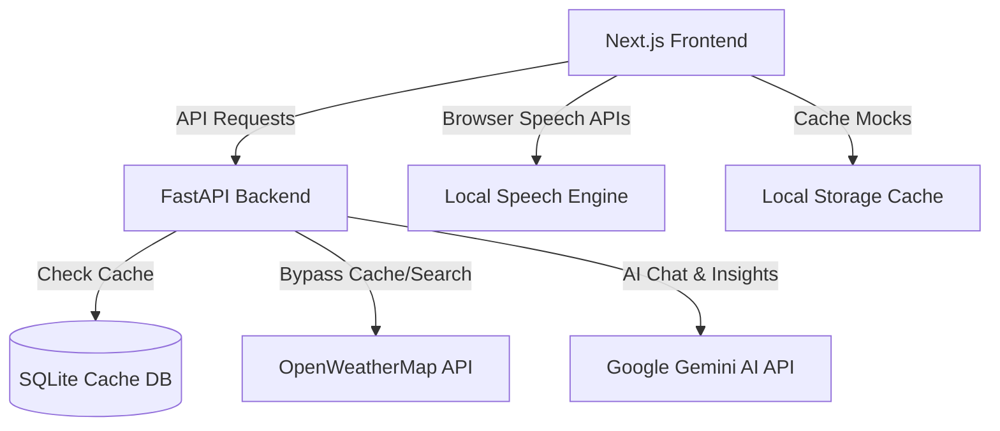

# WeatherGPT — Conversational AI Meteorology Copilot & Disaster Command Dashboard

WeatherGPT is a production-ready, conversational AI weather assistant and disaster management command center designed for the Ministry of Earth Sciences (MoES) and the India Meteorological Department (IMD). 

It answers three core questions for users and disaster response teams:
1. **What is happening?** (Real-time weather metrics, official local warning bulletins, and 7-day forecasts)
2. **What does it mean?** (AI-powered Weather Risk Engine assessing topographical vulnerabilities and weather parameters)
3. **What should I do?** (Actionable, role-specific safety recommendations tailored to travelers, farmers, school administrators, and emergency responders)

---

## 🔗 Live Deployments (Render Free Tier)

- **Frontend Application**: [https://weathergpt-frontendnew.onrender.com](https://weathergpt-frontendnew.onrender.com)
- **Backend API**: [https://weathergpt-backendnew.onrender.com](https://weathergpt-backendnew.onrender.com)

---

## 🌟 Key Features

* **AI Weather Chatbot**: Grounded in real-time meteorological feeds to prevent AI hallucinations. Supports English, Hindi, and Marathi.
* **Agro-Meteorology (Farmer Mode)**: Offers specific agricultural recommendations (e.g., delaying irrigation or harvesting based on heavy rainfall predictions) in local languages.
* **Weather Risk Engine**: Calculates a transparent `0-100` risk score (Low, Moderate, High, Severe) with clear factor breakdowns ("Why This Risk?") detailing wind, visibility, rainfall, and terrain hazards.
* **Route Weather Intelligence**: Analyzes travel safety along specific highway corridors (e.g., Pune to Mumbai Expressway) waypoint-by-waypoint, warning of landslides in ghat zones and micro-climate hazards.
* **Disaster Command Center**: Displays aggregate metrics (active alerts, flood-risk zones, severe storm areas) and compiles an AI-generated tactical situation summary.
* **Interactive Live Map**: Leaflet-based dark-themed map layer highlighting warning zones and weather overlays without requiring paid map API keys.
* **Speech-to-Text & Text-to-Speech**: Integrates browser-native speech synthesis and recognition for voice-enabled queries.
* **Offline Resilience**: Automatically caches last-fetched weather feeds to Local Storage, transitioning to a graceful offline mode with warning indicators if connections drop.

---

## 🏗️ Architecture



---

## 📁 Codebase Directory Structure

```
├── backend/
│   ├── app/
│   │   ├── config/          # Environment settings configuration
│   │   ├── models/          # SQLAlchemy Database models (WeatherCache, OfficialAlert)
│   │   ├── routes/          # FastAPI Route controllers (chat, weather, routes, alerts, disaster)
│   │   ├── services/        # Business logic services (AI agent, weather API, risk calculator)
│   │   └── main.py          # FastAPI application entry point
│   ├── tests/               # Backend integration and endpoint tests
│   ├── requirements.txt     # Python packages dependencies
│   └── Dockerfile           # Docker configuration for production backend
│
├── frontend/
│   ├── src/
│   │   └── app/
│   │       ├── components/  # Next.js UI Components (Interactive Leaflet Map, chatbot)
│   │       ├── globals.css  # Global Tailwind styles & map dark filters
│   │       ├── layout.tsx   # Root layout configuration
│   │       └── page.tsx     # Main dashboard interface
│   ├── package.json         # Node.js dependencies and script configs
│   ├── tsconfig.json        # TypeScript compile configuration
│   └── Dockerfile           # Multi-stage Next.js production build configuration
│
└── render.yaml              # Render Infrastructure-as-Code Blueprint spec
```

---

## 🛠️ Local Installation & Setup

### Prerequisites
* **Node.js** v18+ and **NPM** v9+
* **Python** 3.10+

### 1. Backend Setup
1. Navigate to the `backend/` directory:
   ```bash
   cd backend
   ```
2. Create and activate a Python virtual environment:
   ```bash
   python -m venv .venv
   # On Windows
   .venv\Scripts\activate
   # On macOS/Linux
   source .venv/bin/activate
   ```
3. Install the dependencies:
   ```bash
   pip install -r requirements.txt
   ```
4. Create a `.env` file in the `backend/` directory:
   ```env
   PORT=8000
   DEMO_MODE=True
   DATABASE_URL=sqlite:///./weathergpt.db
   GEMINI_API_KEY=your_gemini_api_key_here
   OPENWEATHER_API_KEY=your_openweather_api_key_here
   ```
   *(Note: Leave `GEMINI_API_KEY` empty to fallback to the local rule-based NLP advisory engine if you don't have a Gemini API key).*
5. Start the backend:
   ```bash
   python app/main.py
   ```
   The backend API will run on `http://localhost:8000`.

### 2. Frontend Setup
1. Open a new terminal and navigate to the `frontend/` directory:
   ```bash
   cd frontend
   ```
2. Install the Node modules:
   ```bash
   npm install
   ```
3. Start the Next.js development server:
   ```bash
   npm run dev
   ```
4. Open [http://localhost:3000](http://localhost:3000) in your web browser.

---

## ☁️ Deployment Guide (Render Free Tier)

WeatherGPT includes a fully validated `render.yaml` configuration that automatically deploys the application using Render's **Free Plan** (native Python and Node.js runtimes).

### Environment Variables on Render
Configure these environment variables in your Render Dashboard for the backend service (`weathergpt-backendnew`):

| Variable Name | Description | Required? |
|---|---|---|
| `DEMO_MODE` | Set to `True` to enable baseline mock data for Pune/Mumbai corridors. | Yes (Defaults to True) |
| `DATABASE_URL` | SQLAlchemy SQLite cache target (`sqlite:///./weathergpt.db`). | Yes |
| `OPENWEATHER_API_KEY` | Your OpenWeather API key. | Optional (Enables live weather fetching) |
| `GEMINI_API_KEY` | Your Google Gemini API Key. | Optional (Enables generative AI advisor) |

### Deployment Steps
1. Push your changes to your Git repository (e.g. GitHub).
2. Go to the [Render Dashboard](https://dashboard.render.com).
3. Click **New +** $\rightarrow$ **Blueprint**.
4. Link your repository.
5. Review the blueprint (it automatically detects `weathergpt-backendnew` and `weathergpt-frontendnew` services).
6. Click **Apply**. Render will build and deploy the services for free!

---

## 🛡️ Responsible AI & Source Transparency

* **Separation of Concerns**: Official meteorological warnings (labeled *🔴 ACTIVE WARNING*) are demarcated with distinct red warning borders. The chatbot advisory responses are labeled as *AI advisory recommendations* to prevent users from confusing AI advice with official government directives.
* **Explainable Risk Scores**: Every risk score displays a direct table explaining how much each weather parameter (visibility, wind speed, precipitation, topography) contributed to the final score.
* **Grounded Responses**: If real-time weather feeds are unavailable for a specific searched location, the chatbot prompts the user for a valid city instead of fabricating coordinates or temperature numbers.
