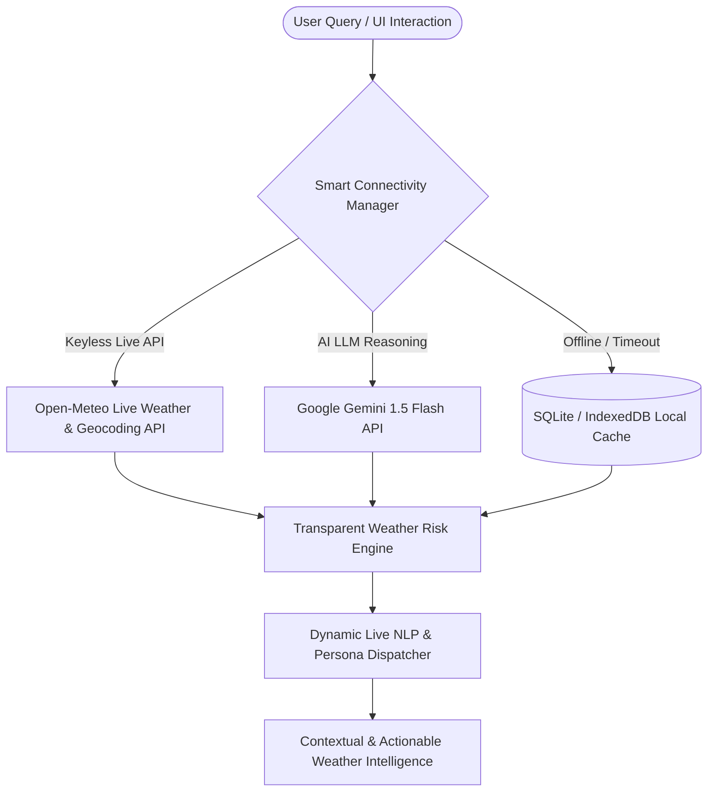

# WeatherGPT — AI Weather Intelligence & Disaster Preparedness Platform

> **"Understand the Weather. Predict the Risk. Take the Right Action."**

WeatherGPT is an AI-powered, multilingual, offline-resilient weather intelligence and disaster-management platform. Designed specifically for the Indian meteorological context, it transforms raw weather feeds and complex radar/bulletin data into **understandable, contextual, actionable, and explainable** intelligence for citizens, travelers, farmers, and disaster authorities.

---

## 1. Chosen Vertical

**Vertical**: Climate Tech / AI Weather Intelligence / Disaster Risk Management & Public Safety

Weather information in India is often fragmented across multiple government portals, bulletins, and satellite feeds. While users may receive raw numbers (e.g., *"72mm rainfall, wind 45 km/h"*), they frequently lack critical context:
- *What does this mean for my safety?*
- *Can I travel from Pune to Mumbai on the highway today?*
- *Should I irrigate my crops or delay harvesting?*
- *Is my area at risk of flash floods or landslides?*

WeatherGPT bridges this gap by acting as a **Decision Support Copilot** answering three core questions:
1. **WHAT IS HAPPENING?** (Live weather, forecasts, hourly timelines)
2. **WHAT DOES IT MEAN?** (Explainable risk scoring, terrain vulnerability, route hazard mapping)
3. **WHAT SHOULD I DO?** (Role-specific actionable advice for general public, travelers, farmers, and emergency teams)

---

## 2. Approach and Architecture

WeatherGPT uses an **Offline-Resilient & Dynamic Live API Architecture** built on three core pillars:



### Key Architectural Decisions:
- **Keyless Live Weather Integration**: Uses **Open-Meteo API** to dynamically fetch live weather metrics (temperature, rain probability, condition, wind speed, humidity) and geocode any city globally without requiring paid API keys.
- **Dynamic Live NLP Engine**: The multilingual chatbot extracts location names dynamically (e.g. Mau, Lucknow, Satara, Mumbai) and builds responses grounded in live weather feeds across English, Hindi, and Marathi.
- **Interactive GIS Map Layers**: Live switching between **Temperature**, **Rainfall Forecast**, **Wind Speeds**, and **Warning Areas** map layers with active layer badges and custom Leaflet marker overlays.
- **Transparent Weather Risk Engine (0–100 Score)**: Instead of arbitrary black-box AI scores, risks are computed deterministically using weighted meteorological vectors:
  $$\text{Risk Score} = \text{Rainfall Impact} + \text{Wind Surge} + \text{Lightning Index} + \text{Flood Vulnerability}$$
- **Smart Active City Sync**: If a user asks a general question (e.g. *"Will it rain today?"*), the chatbot automatically syncs with the active dashboard location.
- **Hackathon Presentation Controller**: An integrated 9-step story bar allowing judges or presenters to effortlessly execute the full end-to-end demonstration flow.

---

## 3. Core Capabilities & Modules

1. **Weather Dashboard & Hourly Timeline**: Interactive weather cards displaying live temperature, feels like, humidity, wind, pressure, visibility, UV index, rain probability, AQI, and data freshness indicators.
2. **AI Weather Assistant (Multilingual & Multi-Persona)**: Conversational copilot supporting English, Hindi (हिंदी), and Marathi (मराठी) with Web Speech API voice synthesis and speech recognition. Supports specialized personas:
   - *General Public*
   - *Traveller Mode*
   - *Farmer / Agricultural Advisory*
   - *Disaster Command Control*
   - *School / College Administration*
3. **Route Weather Intelligence**: Analyzes travel safety along highway corridors (e.g., Pune $\rightarrow$ Mumbai Expressway via Lonavala, Khopoli, Panvel), rating risk waypoint-by-waypoint and suggesting optimal departure windows.
4. **Interactive GIS Weather & Disaster Map**: Leaflet GIS map with toggleable Map Layers (**Temperature**, **Rainfall**, **Wind Speeds**, **Warning Areas**) and click-to-view city risk popups.
5. **Disaster Command Center & Emergency Preparedness**: Tactical dashboard for authorities displaying active alerts, flood-risk zones, AI situation summaries, nearby safe shelter finder, and hazard safety checklists.
6. **Disaster & What-If Simulation Engine**: Scenario testing (Heavy Rain, Flood, Heatwave, Cyclone, Thunderstorm) or parameter sliders (+% Rain, +°C Temp, +km/h Wind) to compute hypothetical risk deltas.
7. **Climate Insights & Report Generator**: 30-year climatological baseline analytics and 1-click Weather Report generation exportable as **JSON**, **CSV**, or **TXT**.

---

## 4. Assumptions & Fallbacks

1. **Keyless Execution**: Operates out-of-the-box using free keyless APIs (Open-Meteo) for live real-time weather globally.
2. **API Resilience**: If external API calls fail or time out, the system automatically falls back to SQLite cached data or local demo datasets without crashing.
3. **Browser Capabilities**: Voice assistant features rely on native Browser Web Speech APIs (`webkitSpeechRecognition` & `SpeechSynthesis`). When unsupported, the UI gracefully degrades to text-only mode.

---

## 5. Evaluation Focus Areas

### 🟢 Code Quality (Structure, Readability, Maintainability)
- **Frontend**: Modular Next.js component hierarchy (`WeatherMap`, `HackathonPresentationBar`, `DisasterSimulationModal`, `EmergencyCenterModal`, `ClimateInsightsModal`, `ReportGeneratorModal`). Strict TypeScript interfaces for all data contracts.
- **Backend**: Clean FastAPI router modularity (`routes/weather.py`, `chat.py`, `route.py`, `alerts.py`, `disaster.py`, `emergency.py`, `simulation.py`, `climate.py`, `location.py`, `report.py`). Pydantic models for request validation and SQLAlchemy ORM models for database persistence.

### 🛡️ Security (Safe and Responsible Implementation)
- **Environment Key Hygiene**: Optional API keys (`GEMINI_API_KEY`, `OPENWEATHER_API_KEY`) are kept strictly server-side in backend `.env`.
- **Input Sanitization**: User chat inputs and location query parameters are sanitized before querying databases (parameterized SQL queries via SQLAlchemy).
- **Trust & Source Transparency**: Official government alerts (*🔴 ACTIVE WARNING*) are visually distinct from AI recommendations. AI summaries explicitly disclaim official authority boundaries.

### ⚡ Efficiency (Optimal Use of Resources)
- **Fast Build & Load Times**: Production build compiles cleanly using Next.js Turbopack.
- **Intelligent Caching**: LocalStorage and SQLite caching minimize redundant API requests. Repeated queries within the cache TTL are served instantaneously.

### 🧪 Testing (Validation of Functionality)
- **Automated Integration Tests**: Comprehensive test suite in [`backend/tests/test_backend.py`](file:///d:/vivek%20idea/backend/tests/test_backend.py) validating all 12 core API endpoints:
  ```bash
  backend\.venv\Scripts\python.exe backend/tests/test_backend.py
  ```
  - **Result**: All 12 backend integration tests PASSED with Exit Code 0.

### ♿ Accessibility (Inclusive and Usable Design)
- **High-Contrast Glassmorphic UI**: Curated dark-mode color palettes with visual risk pills (Emerald = Low, Amber = Moderate, Orange = High, Red = Severe).
- **Multilingual Support**: Fully localized UI labels and chatbot responses in **English**, **Hindi (हिंदी)**, and **Marathi (मराठी)**.
- **Voice Navigation**: Built-in Speech-to-Text microphone input and Text-to-Speech voice playback.

---

## 🚀 Quick Start & Local Setup

### 1. One-Click Windows Demo Runner
Double-click `run_demo.bat` in the root folder to start both Backend and Frontend servers automatically!

### 2. Backend Setup (FastAPI)
```bash
cd backend

# Create virtual environment
python -m venv .venv
.venv\Scripts\activate   # On Windows (or source .venv/bin/activate on Linux/Mac)

# Install dependencies
pip install -r requirements.txt

# Run automated test suite
python tests/test_backend.py

# Start FastAPI server
python app/main.py
```
*Backend runs on `http://localhost:8000`*

### 3. Frontend Setup (Next.js)
```bash
cd frontend

# Install packages
npm install

# Start development server
npm run dev
```
*Frontend runs on `http://localhost:3000`*

---

## 📜 Tagline & Hackathon Motto

> **"WeatherGPT — Understand the Weather. Predict the Risk. Take the Right Action."**
